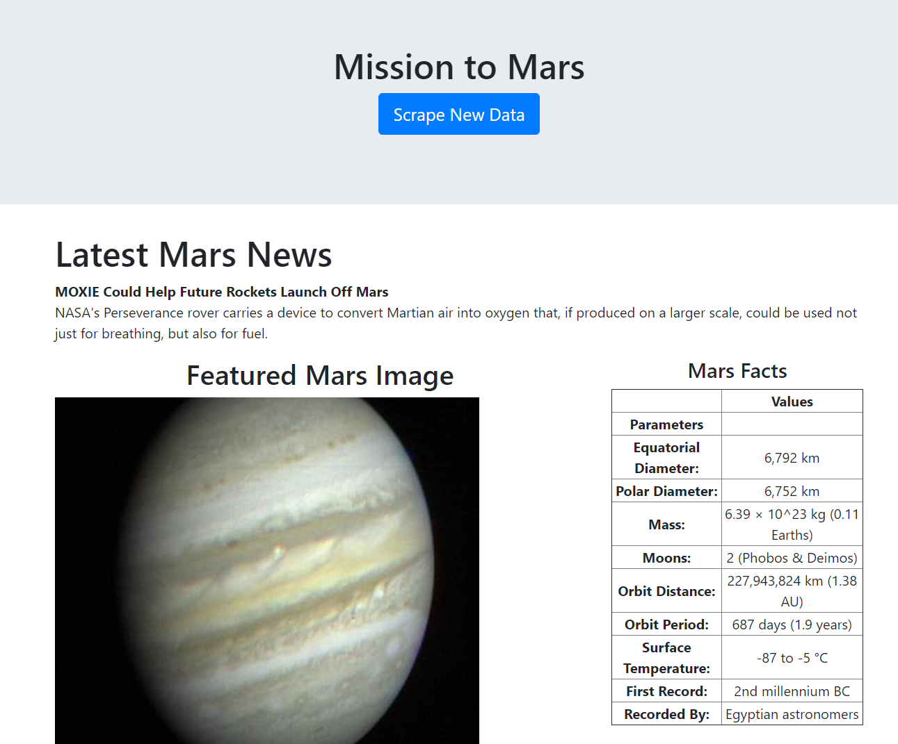

# MarsScrapingData
A python application that scrapes selected information from https://mars.nasa.gov/news/.

### Instructions
Ensure you have the used in the py files installed in your environment. Then in your bash terminal, run "python app.py".

### Visual Example:

